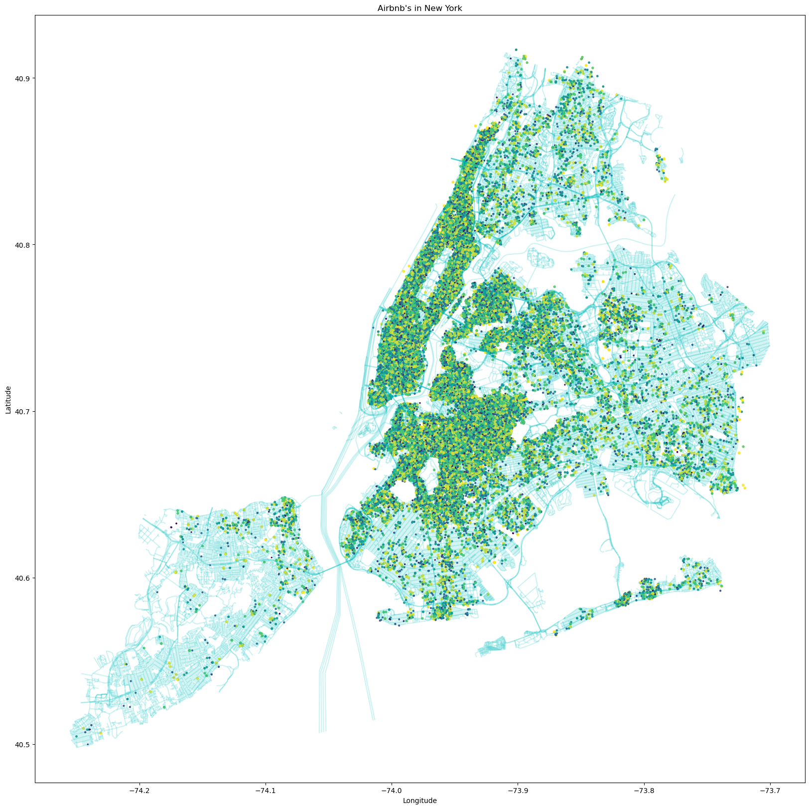
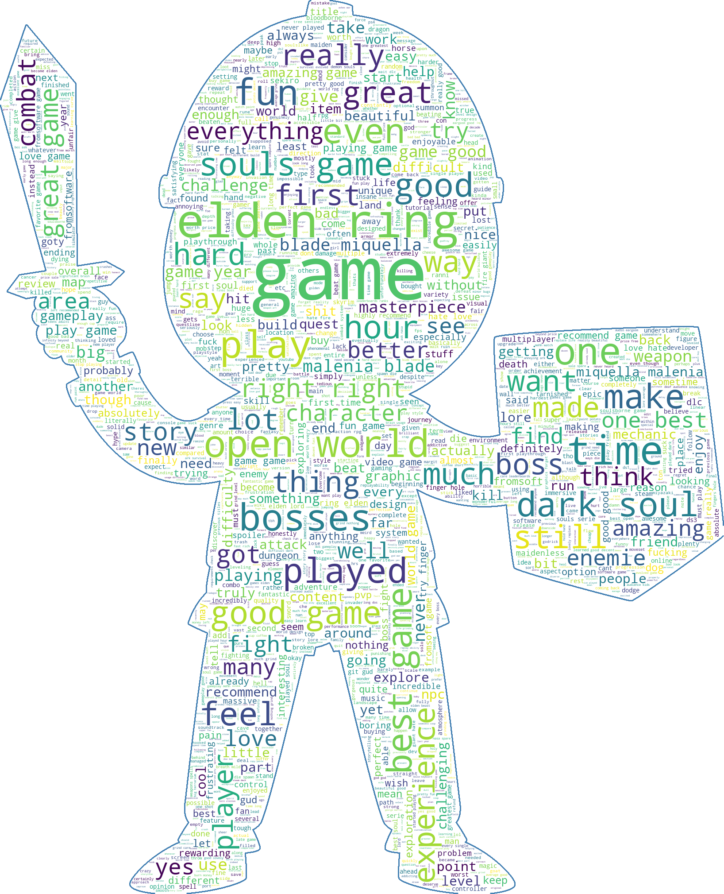
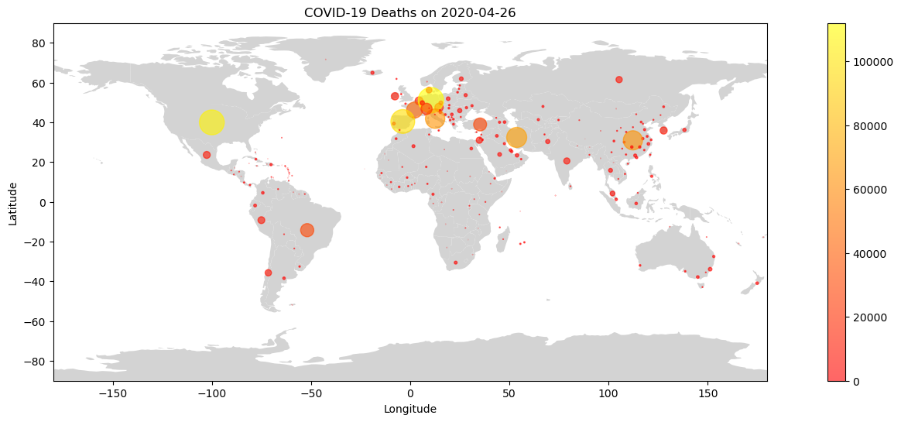
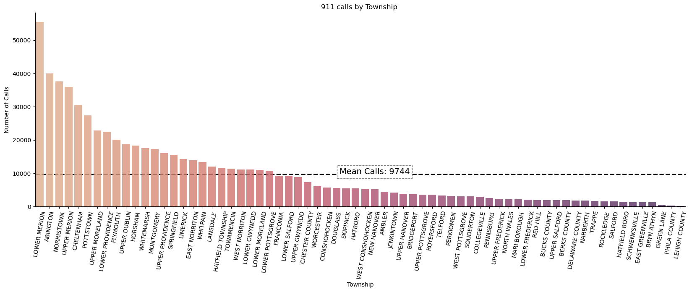

# Portfolio

## Phyton Data Analysis

---

#### Airbnb's in New York

---

#### Elden Ring Game Reviews

---

#### Covid Deaths Mapping

.html)

---

#### 911 Calls

---

#### New York City Bikes Use

---

## Older Projects

---

### Machine Learning Projects

#### Predicting the odds of a bank customer accepting a new campaign offer

On this project the goal was to predict if a bank client would say yes or no to a new campaign offer proposed by the bank. This was a group project, in which we used python and some of its libraries, the most important libraries where pandas, skl-learn and streamlit.

---

#### Predicting if whether a constructor work has positive or negative cost.

On this project the goal was to predict if whether a constructor work has positive or negative cost. This was a solo project, in which I used python and some of its libraries, the most important libraries where pandas, skl-learn and streamlit, similar to my other machine learning project.

---

#### Data warehouse project

On this project the goal was to deal with a big dataset, with about 2 million lines of data, do an ETL process on it and then make data visualizations with the data that resulted from the ETL process.
For this project we used Talend data quality, Talend data integration, MySql and Tableau, unfortunately, I have lost the data visualision graphics that we did at the time, but I do have a video explaining what we did in detail on the ETL process. The video is narrated in Portuguese.

---

#### PowerBi visualizations

I have done some projects with powerBI in the past, here are some of the reports I have done.

---

© 2021 José Lopes. Powered by Jekyll and the Minimal Theme.

