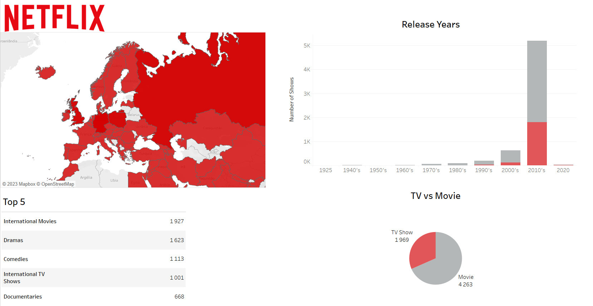
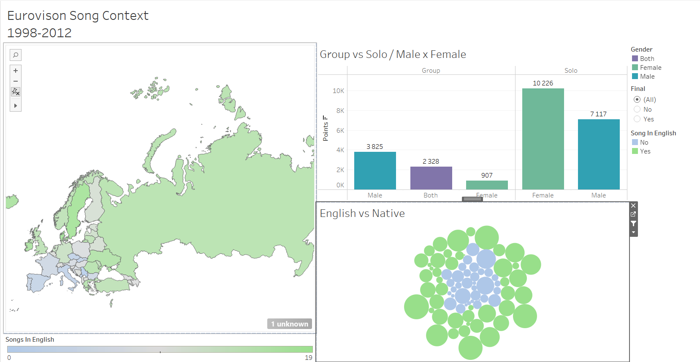
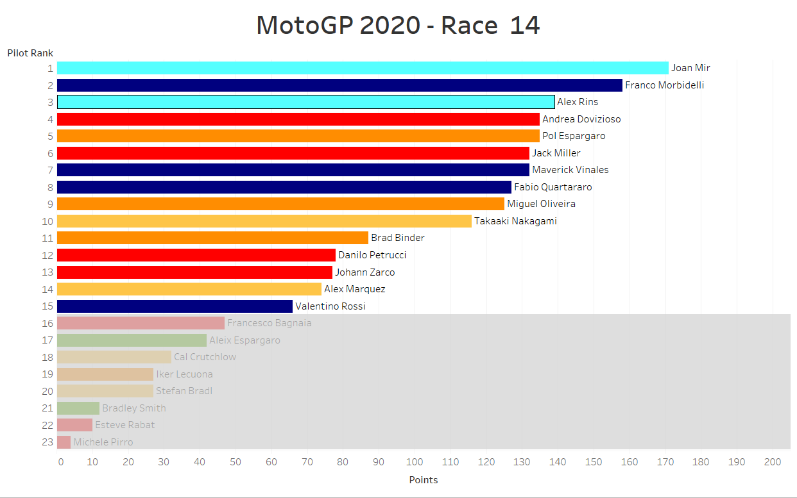
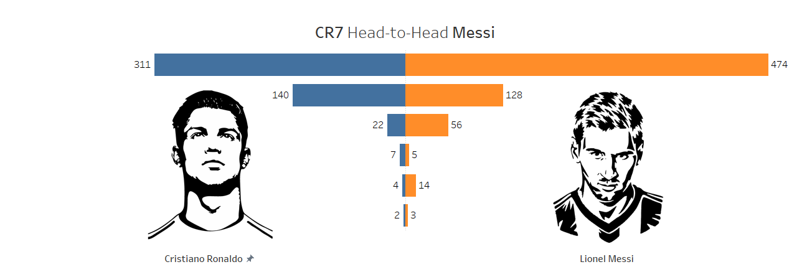
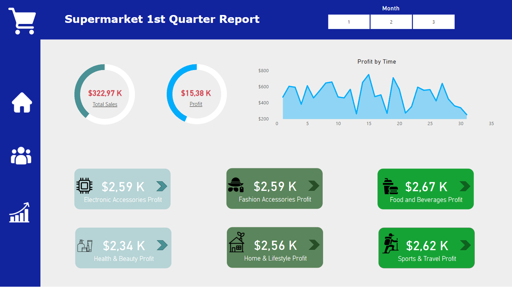
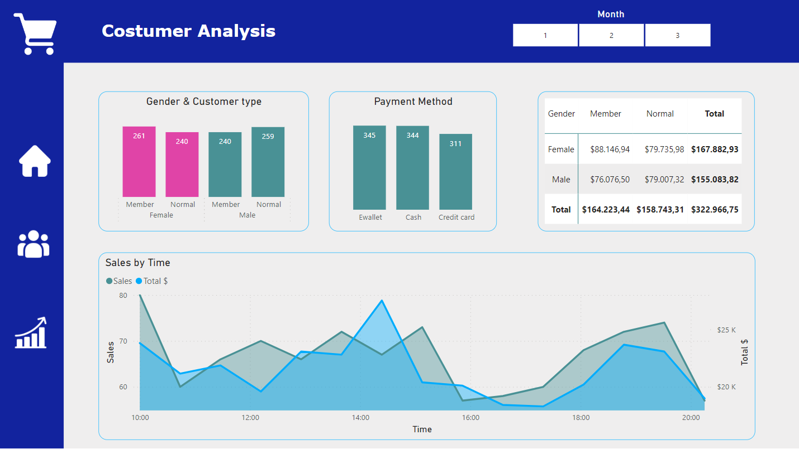
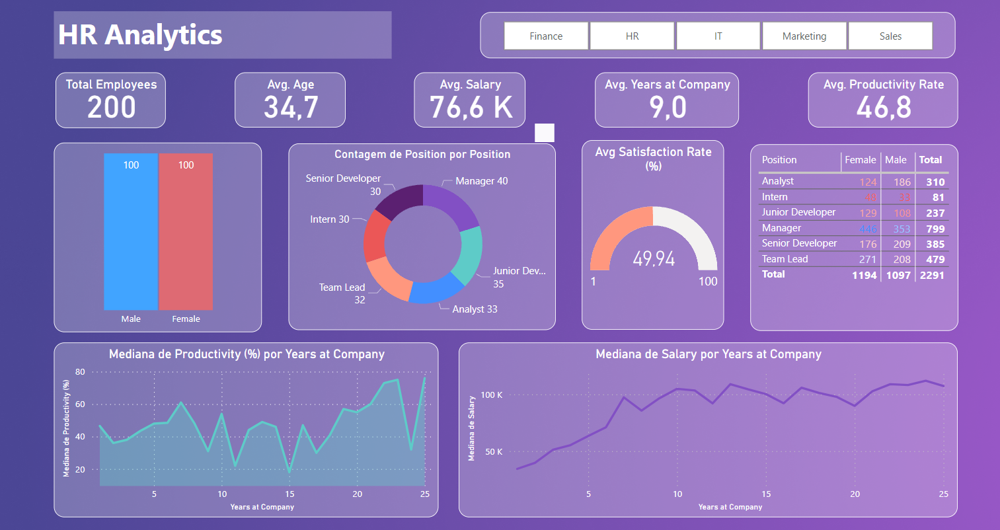

# Portfolio

## Tableau Visualizations

---
#### Netflix Visualization

---
#### Eurovision 1998-2012

---
#### MotoGP 2020 Bar Race

---
#### CR7 vs Messi

---

## PowerBi visualizations
---

#### Supermarket Sales Report

<!-- Slideshow container -->

  <!-- Full-width images with number and caption text -->
  

    
1 / 3

    
    
  

  

    
2 / 3

    
   
  

  

    
3 / 3

    
    
  

  <!-- Next and previous buttons -->
  <a class="prev" onclick="plusSlides(-1)">&#10094;</a>
  <a class="next" onclick="plusSlides(1)">&#10095;</a>

 

<!-- The dots/circles -->

  
  
  

---

#### HR Analytics Report

---
## Phyton Data Analysis

---

#### Airbnb's in New York

---

#### Elden Ring Game Reviews

---

#### Covid Deaths Mapping

.html)

---

#### 911 Calls

---

#### New York City Bikes Use

---

© 2023 Luís Costa. Powered by Jekyll and the Minimal Theme.

